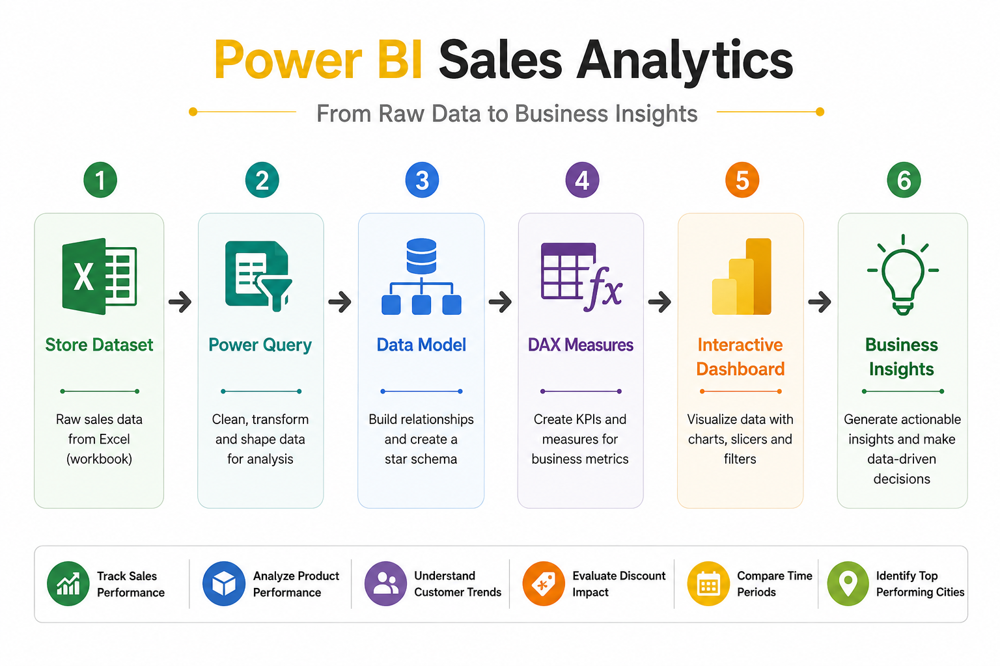
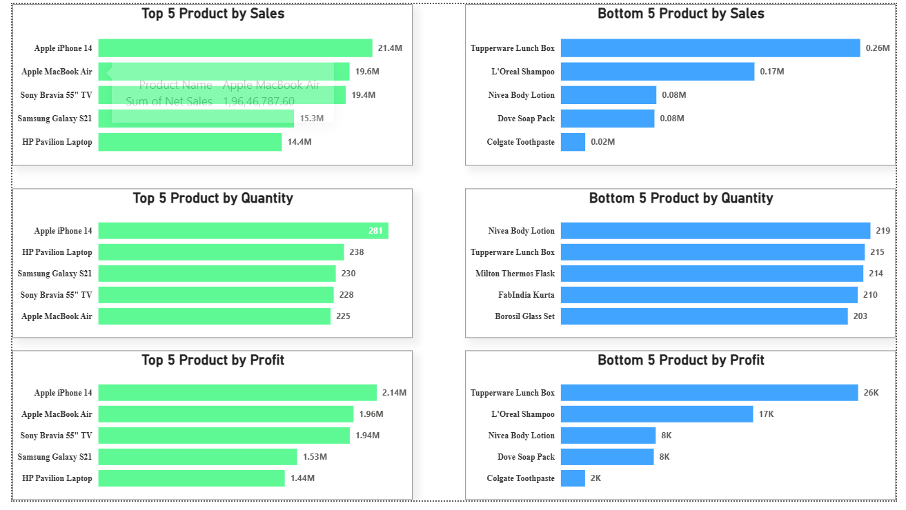
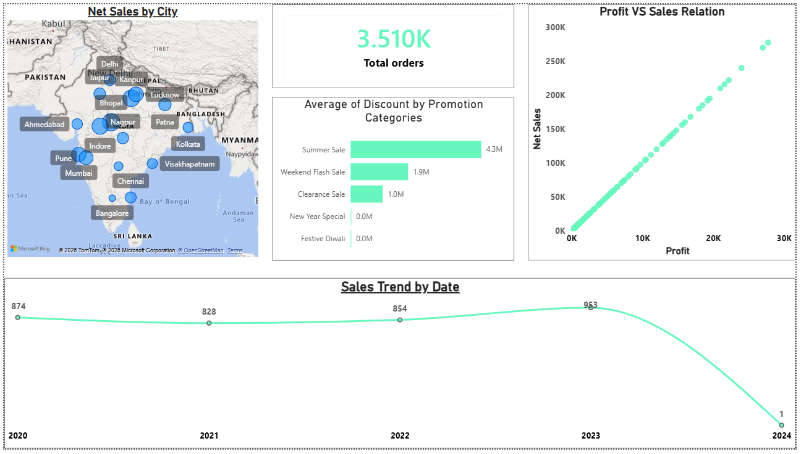
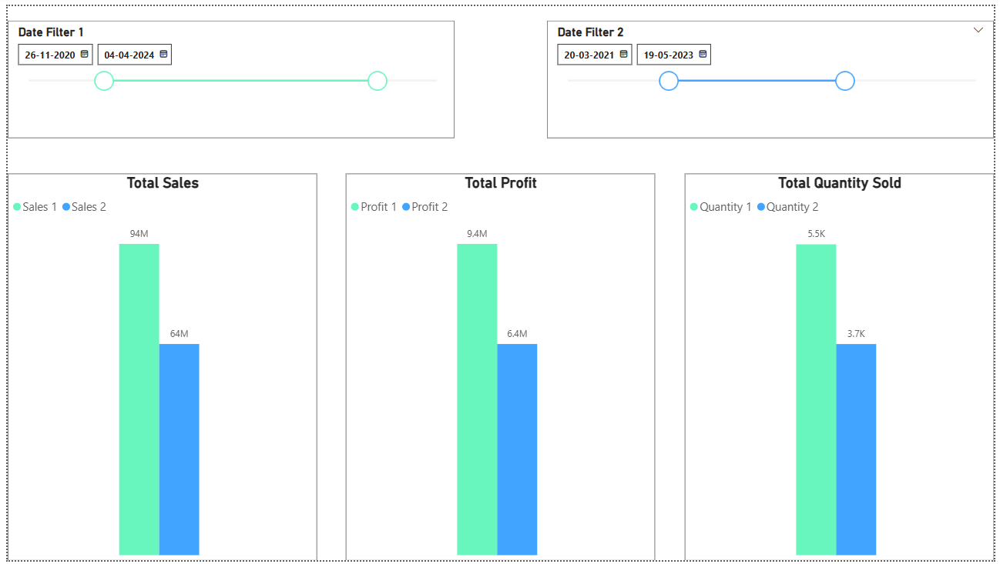

# Power BI Sales Analytics

An interactive Business Intelligence project built using **Power BI**, **Power Query**, **DAX**, and **Data Modeling** to analyze sales performance, profitability, product performance, customer orders, and revenue trends.

The dashboard transforms raw sales data into actionable business insights through interactive visualizations, KPI reporting, comparative analysis, and dynamic filtering.

---

## 🛠 Tech Stack

<p align="left">


</p>

---

# Dashboard Workflow



---

# Project Overview

Retail businesses generate large volumes of transactional sales data every day. Without proper reporting, it becomes difficult to monitor revenue, profitability, product performance, customer behavior, and sales trends.

This project demonstrates how Power BI can transform raw sales data into an interactive dashboard that supports business decision-making through dynamic visualizations, KPI tracking, and comparative analysis.

---

# Business Problem

A retail company wants to answer questions such as:

- Which products generate the highest revenue?
- Which products perform poorly?
- How are sales changing over time?
- How do profit and sales relate?
- Which cities generate the highest sales?
- What impact do discounts have on sales performance?

---

# Solution

An interactive Power BI dashboard was developed using:

- Power Query for data preparation
- Data Modeling for relationships
- DAX Measures for KPI calculations
- Interactive visualizations for business reporting

The dashboard enables users to explore sales performance through filters, slicers, and comparative analysis.

---

# Business Metrics

The dashboard provides insights into:

- Total Sales
- Total Profit
- Total Orders
- Total Quantity Sold
- Top 5 Products by Sales
- Bottom 5 Products by Sales
- Top & Bottom Products by Profit
- Top & Bottom Products by Quantity
- Monthly Sales Trend
- Profit vs Sales Analysis
- City-wise Sales Analysis
- Discount Analysis
- Comparative Period Analysis

---

# Technology Overview

| Category | Technology |
|------------|------------|
| Visualization | Power BI Desktop |
| Data Preparation | Power Query |
| Analytics | DAX |
| Data Modeling | Star Schema |
| Data Source | Microsoft Excel |

---

# Dashboard Pages

## Product Performance Dashboard

- Top 5 Products by Sales
- Bottom 5 Products by Sales
- Top 5 Products by Profit
- Bottom 5 Products by Profit
- Top 5 Products by Quantity
- Bottom 5 Products by Quantity



---

## Sales & Profit Dashboard

- Sales Trend
- Profit vs Sales
- Discount Analysis
- City-wise Sales
- Total Orders



---

## Comparative Sales Dashboard

Compare sales performance between two user-selected time periods using dynamic date filters.



---

# Project Highlights

- Interactive Sales Dashboard
- Dynamic KPI Reporting
- Advanced DAX Measures
- Power Query Transformations
- Star Schema Data Modeling
- Comparative Sales Analysis
- Interactive Filtering & Slicers
- Business Insight Generation

---

# Power BI Skills Applied

### Data Preparation

- Power Query
- Data Cleaning
- Data Transformation

### Data Modeling

- Relationships
- Star Schema
- Data Model Optimization

### DAX

- Measures
- KPI Calculations
- Aggregations
- Time-based Analysis

### Visualization

- KPI Cards
- Bar Charts
- Line Charts
- Scatter Charts
- Maps
- Slicers
- Interactive Filters

---

# Repository Structure

```text
powerbi-sales-analytics
│
├── README.md
├── BUSINESS_REQUIREMENTS.md
├── Sales_Data_Analysis.pbix
├── store_dataset.xlsx
│
└── screenshots
    ├── dashboard_workflow.png
    ├── top_bottom_products.png
    ├── sales_profit_analysis.png
    └── comparative_sales_analysis.png
```

---

# Project Documentation

📄 [Business Requirements](BUSINESS_REQUIREMENTS.md)

---

# Author

**Sagar Bairwa**

📧 Email: sagar.bairwa.tech@gmail.com

💼 LinkedIn: https://linkedin.com/in/sagarbairwa

💻 GitHub: https://github.com/sagar-bairwa

---

⭐ If you found this project helpful, consider giving it a Star.
